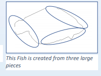
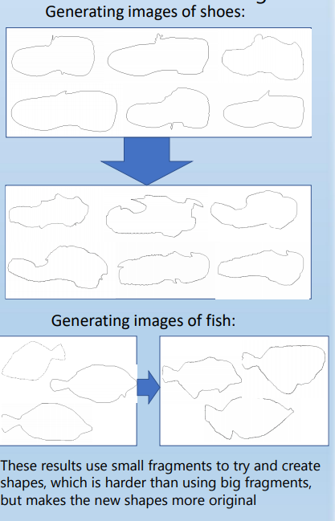

# shapegen
contains methods for shape generation from examples

uses FLANN to compare image parts and various heuristics to compare relative part placement
including polynomial splines, image characteristics, image part recombination and comparison, and shape evolution

TODO: incorporate ML methods for generation of image parts and combination

